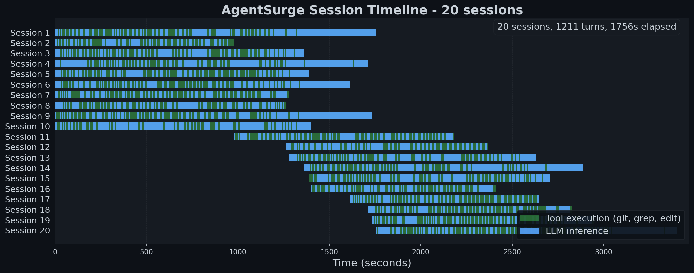
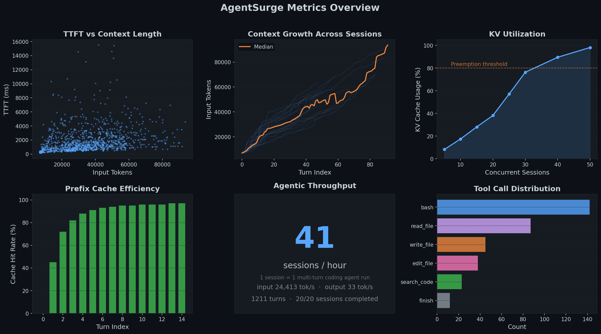

# AgentSurge - LLM Serving Benchmark for Coding Agent Workloads

AgentSurge replays real coding-agent traces - multi-turn tool calls, file edits, bash commands - against a vLLM endpoint and measures TTFT, TPOT, KV utilization, and prefix-cache hit rate as concurrency scales up.





## Quick start

Run 20 coding-agent sessions concurrently against your vLLM server:

```bash
agentsurge run --source openhands --n-sessions 20 --client-concurrency 10 \
   --tool-mode replay --save-responses --arrival gamma \
   --tokenizer /path/to/gemma-4-31B-it \
   --vllm-url http://server:18003 --model gemma-4-31b-it
```

```
╭───────────── AgentSurge Results  ·  gemma-4-31b-it  ·  1756.3s ──────────────╮
│                                                                              │
│    ── Workload statistics ──                                                 │
│    Sessions                   20 (20 completed)                              │
│    Turns                      1,211 (60.5 avg/session)                       │
│    Input:Output ratio         743:1 (tokens)                                 │
│    Tokens                     42.9M input, 57.7K output                      │
│                                                                              │
│    ── Server statistics ──                                                   │
│    Sessions/hr                40*                                            │
│    Requests/s                 0.7                                            │
│    Input tok/s                24.4K                                          │
│    Output tok/s               32                                             │
│                                                                              │
│    Time to first token    p50  1,309 ms  p95   5,121 ms  p99   9,123 ms      │
│    Time per output token  p50    211 ms  p95     453 ms  p99     661 ms      │
│    End-to-end latency     p50  8,584 ms  p95  39,647 ms  p99  84,034 ms      │
│    Peak KV cache utilization  14.0% (of GPU memory)                          │
│    Prefix cache hit rate      97.6% (per-request)                            │
│                                                                              │
╰──────────────────────────────────────────────────────────────────────────────╯
```

\*Notes on the sample output above:

- **Session**: one complete multi-turn agent trace (N turns end-to-end).
- **Sessions/hr**: `n_completed / wall_clock_s × 3600`.
- **Tool mode**: `--tool-mode replay` (recorded OpenHands traces).

Preview the output format with mock data:

```bash
agentsurge run --backend mock --n-sessions 20 --no-metrics --ignore-replay-output-length
```

## Install

Python >= 3.13.

```bash
uv pip install -e .           # core
uv pip install -e ".[run]"   # + transformers
uv pip install -e ".[hf]"    # + HuggingFace/parquet export dependencies
uv pip install -e ".[all]"   # everything
```

## Running a benchmark

### Requirements

1. A **vLLM server** with prefix caching and tool calling enabled:

```bash
python -m vllm.entrypoints.openai.api_server \
 --model Qwen3.5-27B --tensor-parallel-size 4 --port 8000 \
 --max-model-len 65536 --gpu-memory-utilization 0.90 \
 --enable-prefix-caching --enable-auto-tool-choice \
 --tool-call-parser qwen3_xml  # parser is model-specific; see vLLM docs
```

2. Install **AgentSurge** and run:

```bash
uv pip install -e ".[run]"

agentsurge run --source openhands --n-sessions 50 \
   --tool-mode replay \
   --vllm-url http://server:8000 --model Qwen3.5-27B
```

### OpenAI-compatible endpoints

The `openai` backend name means "OpenAI-compatible chat completions endpoint."
It does not add hosted OpenAI API authentication headers, so avoid pointing it
directly at the official hosted OpenAI API unless auth support is provided
outside AgentSurge. Use it for compatible local or self-hosted endpoints:

```bash
agentsurge run --backend openai --vllm-url http://server:8000 --model my-model \
  --source openhands --tool-mode replay --n-sessions 20
```

Metrics are disabled by default for `--backend openai` unless explicitly
configured, because compatible endpoints usually do not expose vLLM Prometheus
metrics.

> **Warning:** In `--tool-mode real`, tool calls (git clone, grep, file edits) run as subprocesses in a local workload-reproduction workspace. This is not a security sandbox; run trusted workloads or provide your own isolation. Network-mounted storage (NFS, CIFS) adds 20-70x latency per file operation, so use `--tool-workspace-dir` on local NVMe for realistic timings.

### Subcommands

| Command | Example | What it does |
|---------|---------|-------------|
| `run` | `agentsurge run --source openhands --n-sessions 50` | Run benchmark against a server |
| `sweep` | `agentsurge sweep --slo-ms 3000` | Binary-search max concurrency meeting a TTFT SLO, or fixed-level sweep with `--probe-levels` |
| `generate` | `agentsurge generate --source openhands -o ./workloads` | Build a workload file for replay (written as `workloads/workload_<timestamp>.json`) |

### Key parameters

| CLI flag | Default | Description |
|----------|---------|-------------|
| `--n-sessions` | 50 | Concurrent agent sessions to run |
| `--client-concurrency` | 100 | Client-side cap on in-flight sessions (asyncio semaphore). Unrelated to server `--max-num-seqs`. |
| `--arrival` | poisson | Session arrival pattern: burst, poisson, gamma, constant, ramp |
| `--max-tokens` | 256 | Maximum output tokens per LLM call (presets override) |
| `--preset` | - | Workload preset (see `--help`) |
| `--source` | - | Trace dataset (see [Data sources](#data-sources)) |
| `--tool-mode` | off | `real`: execute in a per-session local workload-reproduction workspace (`--tool-workspace-dir`), not a sandbox; `replay`: inject saved outputs; `off`: skip tool calls |
| `--multi-turn-only` | off | Keep only sessions with recorded follow-up user turns queued for dynamic tool-loop feeding (currently useful for `--source openhands`) |
| `--thinking-budget` | 8192 | Added on top of `max_tokens` whenever `--enable-thinking` is set (reasoning models) |
| `--ignore-replay-output-length` | off | Use `--max-tokens` for every turn instead of matching replay output |
| `--sanitize-truncated-tool-calls` | off | Recover truncated/malformed tool-call JSON by returning an `[ERROR]` tool output (with the parse error and a preview of the broken arguments) so the session stays alive and the model can retry with smaller args, instead of failing the turn with a parse error. |
| `--use-model-reply-in-next-turn` | auto | `auto`: derive from `--tool-mode` (`real`/`off` → true, `replay` → false). `true`: inject actual model output into next turn. `false`: replay recorded messages. |
| `--seed` | 42 | Seeds arrival schedule, per-session tool-delay and think-time sampling, and interruption draws. Use the same value across runs to reproduce the workload; per-session request content and inter-turn sleeps will match byte-for-byte. Wall-clock timing still varies with hardware speed. |

See `agentsurge run --help` for available presets and their parameters. For arrival patterns, inter-turn delays, and assistant context modes see [docs/workload-tuning.md](docs/workload-tuning.md).

### Run example

3-turn session, showing how each knob affects the LLM request:

```
Tool execution (--tool-mode)        what the LLM sees as input
─────────────────────────────────────────────────────────────────
real    Turn 1: [sys, user]  →  LLM generates tool_call
        Turn 2: [sys, user, assistant(tool_call), tool(tool_output), ...]
        Turn 3: [sys, user, ..., tool(tool_output), ...]

replay  Turn 1: [sys, user]  →  LLM generates response
        Turn 2: [sys, user, assistant, tool(recorded_output), ...]
        Turn 3: [sys, user, ..., tool(recorded_output), ...]

off     Turn 1: [sys, user]  →  LLM generates response
        Turn 2: [sys, user, assistant, user, ...]   ← no tool messages
        Turn 3: [sys, user, assistant, user, ...]

Assistant context (--use-model-reply-in-next-turn / preset)  what fills the assistant slot in the next turn
─────────────────────────────────────────────────────────────────
true (generated)   Turn 2 input: [..., assistant("actual LLM output from turn 1"), ...]
false (replayed)   Turn 2 input: [..., assistant("recorded trace output"), ...]

Output budget (--ignore-replay-output-length)  max_tokens sent in the request
─────────────────────────────────────────────────────────────────
off (default)  Turn 1: max_tokens=142  (replay produced 142 output tokens)
               Turn 2: max_tokens=87   (replay produced 87 output tokens)
on             Turn 1: max_tokens=256  (from --max-tokens, replay ignored)
               Turn 2: max_tokens=256  (from --max-tokens, replay ignored)
```

**Examples** - same workload, different knob combinations:

```bash
# A/B prefix cache comparison: tools off, static context, dynamic budget
agentsurge run --preset simulate-default --tool-mode off

# Capacity planning: tools replayed, real context growth, uncapped output
agentsurge run --preset measure-agent-light --tool-mode replay

# End-to-end agent eval: real tool execution, real context, fixed budget
agentsurge run --preset agent-heavy --tool-mode real --ignore-replay-output-length
```

## Data sources

Agent trace datasets, auto-downloaded from HuggingFace on first use.

| Source | Flag | Turns | Description |
|--------|------|:-----:|-------------|
| openhands | `--source openhands` | 5-30 | CodeAct agent with bash/editor tool calling |
| swe-bench-verified | `--source swe-bench-verified` | 5-20 | Human-verified SWE-bench instances |
| swe-smith-tool | `--source swe-smith-tool` | 3-15 | SWE-Smith traces, native tool_call format |
| swe-smith-xml | `--source swe-smith-xml` | 3-15 | SWE-Smith traces, XML-in-text format |
| swe-smith-ticks | `--source swe-smith-ticks` | 3-15 | SWE-Smith traces, backtick-delimited format |
| swe-evo | `--source swe-evo` | 5-25 | Evolutionary SWE task variants (synthetic traces) |
| abc-bench | `--source abc-bench` | 3-10 | ABC benchmark tasks (first `--tool-mode real` use downloads a ~2.6 GB `tasks.tar.gz` from HF) |
| featurebench | `--source featurebench` | 5-15 | Feature implementation tasks (synthetic traces) |
| mixed | `--source mixed` | varies | Weighted sample across all sources (proportional to available traces per source by default) |

All sources work with `--tool-mode replay` and `--tool-mode off`. `--tool-mode real` runs tool calls in a per-session local workload-reproduction workspace and requires repo metadata, so it only works with openhands, swe-bench-verified, swe-smith-\*, and abc-bench. It is not a security sandbox. featurebench, swe-evo, and mixed have no repo metadata (or mix sources that don't all provide it), so real mode is unavailable there.

### Multi-turn user-message feeding

The dynamic tool-loop runner can now keep replay sessions going across multiple
recorded user turns. For sources that advertise multi-turn support (currently
`--source openhands`), AgentSurge queues every user message after the first and
feeds the next one back into the model whenever the assistant stops without a
tool continuation.

Use `--multi-turn-only` on `run` or `sweep` to keep only sessions that actually
have queued follow-up user turns:

```bash
agentsurge run --source openhands --tool-mode replay --multi-turn-only \
  --n-sessions 50 --vllm-url http://server:8000 --model Qwen3.5-27B
```

## Output formats

| File | Format | Contents |
|------|--------|---------|
| `run_*.json` | JSON | Full run config, per-session turns, backend metrics |
| `*_turns.csv` | CSV (13 cols) | Per-turn: session_id, ttft_ms, input/output tokens, errors |
| `*_summary.csv` | CSV (23 cols) | TTFT p50/p95/p99, peak KV cache utilization (`kv_util_peak`), prefix hit rate, sessions/hr, requests/s, input/output tok/s |
| `*_timeline.png` | PNG | Session timeline visualization |
| `run_*_hf/` | Parquet | Local HuggingFace-compatible export for private analysis/reproduction, with README/license/attribution metadata to review before any public sharing (with `--make-dataset`) |

## Measured performance

See [docs/expected-performance.md](docs/expected-performance.md) for H100 results.

## Examples

Scripts in [`examples/`](examples/) - all run locally with the mock backend, no server needed:

| Script | What it does |
|--------|-------------|
| `01_quick_start.py` | MockBackend basics, inspect results |
| `02_custom_sessions.py` | Build ReplaySession objects, serialize, validate, replay |
| `03_callbacks.py` | `on_turn` / `on_session` hooks for progress monitoring |
| `04_custom_backend.py` | Write and register a custom backend |
| `05_run_api.py` | Programmatic `agentsurge.run()` API |

## Docs

| Topic | Link |
|-------|------|
| Expected performance & diagnostics | [docs/expected-performance.md](docs/expected-performance.md) |
| Workload tuning (arrival, delays, context) | [docs/workload-tuning.md](docs/workload-tuning.md) |

## Contributing

See [CONTRIBUTING.md](CONTRIBUTING.md).

## License

AgentSurge code is licensed under [MIT](LICENSE).
